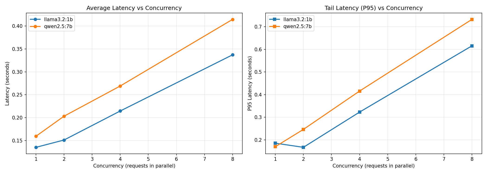

# LLM Serving Benchmarks

Ollama model comparison under concurrent load.

## Setup

```sh
pip install -r requirements.txt
```

## Run Benchmarks

Make sure [mini-llm-gateway](https://github.com/noslack/mini-llm-gateway) is running:

```sh
cd ../mini-llm-gateway
uvicorn main:app --reload
```

Then run the benchmark:

```sh
python bench/load.py
```

Outputs:
- `results/results.csv` — raw data
- `results/benchmark_results.png` — latency charts

## Key Finding

Smaller models (1b) maintain lower latency under concurrency.
Larger models (7b) saturate faster due to memory/compute limits.



- [Analysis notebook](notebooks/analysis.ipynb)
- [Raw results](results/results.csv)
