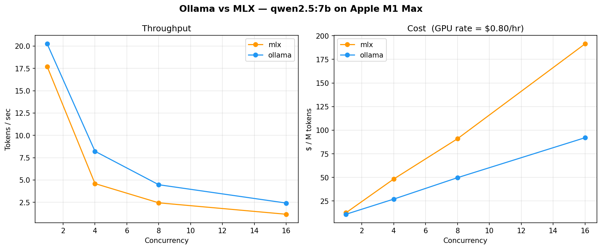
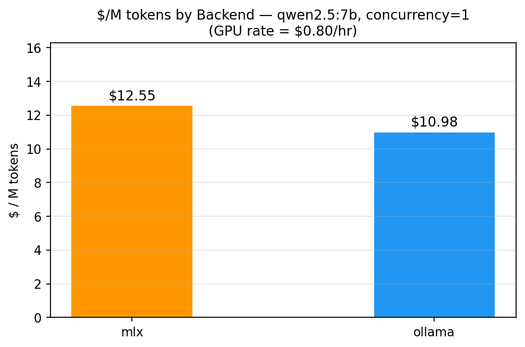
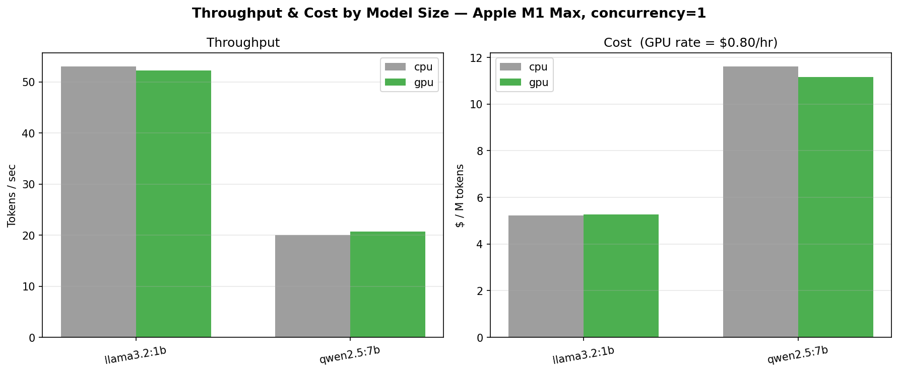
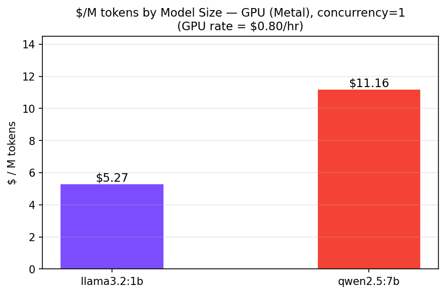
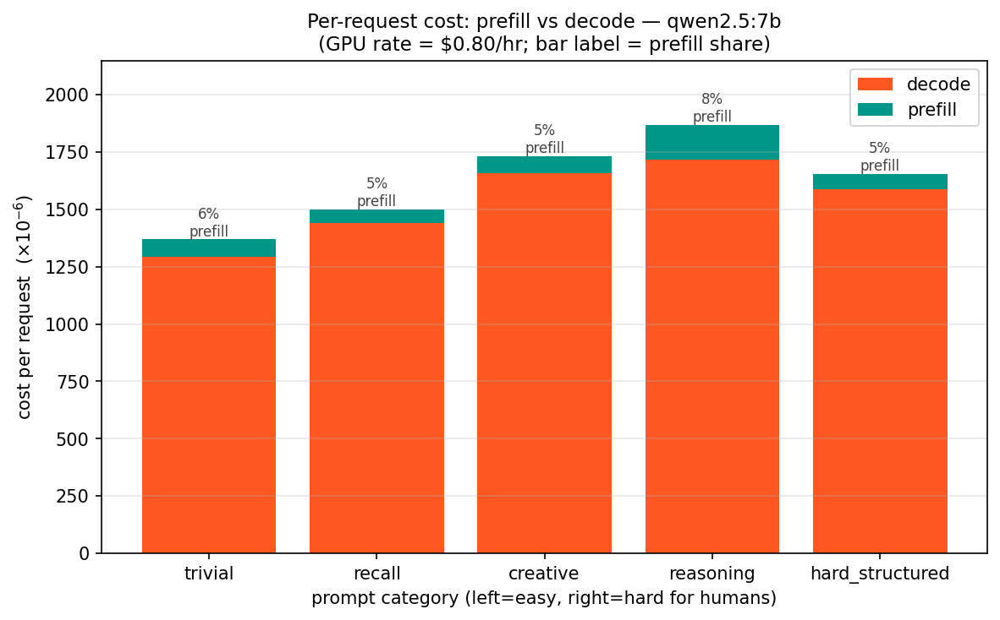
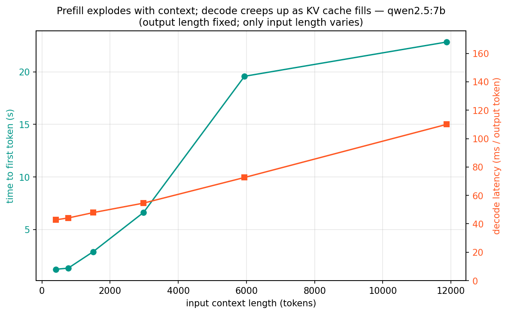
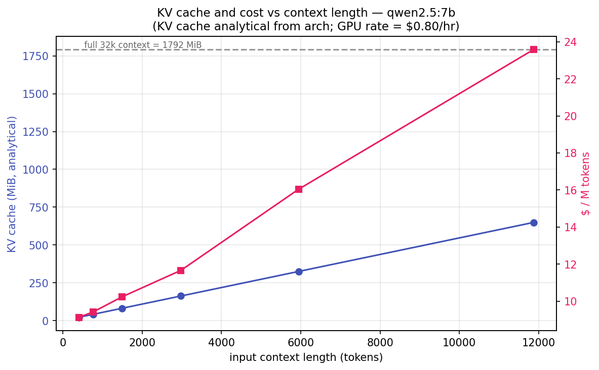

# LLM Serving Benchmarks

Benchmarking suite for local LLM inference on Apple M1 Max (Metal/MPS). Measures throughput, latency, and — most importantly — **cost (`$/M tokens`)** across models, backends, prompts, and concurrency levels.

## Primary metric: $/M tokens

Anyone can publish a tokens/sec chart. The question that actually matters is: *what does this configuration cost, and when does the cheaper option win?* Every result in this repo pairs throughput with a dollar number so that question has an answer.

Cost is computed from a configurable GPU hourly rate via the `GPU_HOURLY_RATE` environment variable (default: **$0.80/hr**, representing an A10G-class cloud GPU or amortized M1 Max machine cost):

```
$/M tokens = (GPU_HOURLY_RATE / 3600) / tokens_per_sec × 1,000,000
```

The exact rate is swappable — set `GPU_HOURLY_RATE=X` before any benchmark run to model a different instance type. The cost logic lives in [`bench/cost_calculator.py`](bench/cost_calculator.py).

Every saved CSV under `results/` carries a `cost_per_million_tokens` column. CSVs collected before cost instrumentation existed were brought up to schema with [`bench/backfill_cost.py`](bench/backfill_cost.py), which recomputes cost deterministically from each row's `tokens_per_sec` — identical to what a fresh run would have written:

```sh
python bench/backfill_cost.py            # idempotent; skips files that already have cost
```

## Key findings

**→ Full write-up with charts and methodology: [REPORT.md](REPORT.md).** Numbers below are from a single reproducible run (`python bench/run_all.py`); see [`results/MANIFEST.json`](results/MANIFEST.json) for the exact host/versions/rate.

- **Context length is the most expensive variable.** At a *fixed* output length, a ~12k-token prompt costs **2.6× more per token** than a ~400-token prompt ($23.6 vs $9.1 /M). TTFT grows **~18×**, decode itself slows **2.5×** under KV-cache pressure, and the KV cache hits **650 MiB** — cost a tokens/sec chart never shows.
- **Prefill vs decode (qwen2.5:7b):** prefill is only **~5–8%** of per-request cost for normal generations, but per token a **decode token costs ~5× a prefill token** — prefill is one parallel compute-bound pass; decode is one memory-bound pass per token. Output length is the cost lever.
- **Ollama vs MLX (qwen2.5:7b):** Ollama is **~1.9× cheaper** ($45 vs $86 /M) under concurrent load — MLX has no continuous batching.
- **Difficulty invariance:** per-token decode latency is flat at **~42 ms/token (±<1%)** from trivial to reasoning prompts. Cost tracks token *count*, not prompt "hardness."
- **Model size (concurrency 1):** `llama3.2:1b` ≈ **$5.2/M** vs `qwen2.5:7b` ≈ **$11.4/M** — a ~2.2× premium for 7× the parameters. CPU vs GPU throughput is within ~3% on this unified-memory M1 (batch-1 decode is memory-bandwidth-bound).

## Charts

| Chart | Description |
|---|---|
|  | Throughput and $/M tokens vs concurrency, Ollama vs MLX |
|  | $/M tokens by backend at concurrency=1 |
|  | Throughput and $/M tokens by model size, CPU vs GPU |
|  | $/M tokens by model size (GPU/Metal, concurrency=1) |
|  | Per-request cost split into prefill vs decode dollars, by prompt category |
|  | TTFT (prefill) growth vs flat decode, as context length scales |
|  | KV-cache growth (analytical) and $/M tokens vs context length |

Regenerate all charts from saved results:

```sh
python charts/generate_charts.py
# or with a custom rate:
GPU_HOURLY_RATE=1.20 python charts/generate_charts.py
```

## Setup

```sh
pip install -r requirements.txt
```

## Run Benchmarks

**Run everything (recommended).** One command preflights the servers, writes a manifest, runs every benchmark, and regenerates all charts:

```sh
# start both gateways first (in ../mini-llm-gateway):
BACKEND=ollama uvicorn main:app --port 8000
BACKEND=mlx    uvicorn main:app --port 8001
# then:
python bench/run_all.py            # full suite
python bench/run_all.py --dry-run  # preflight + plan only, nothing executed
```

Steps whose server dependency is down are skipped (not failed). Individual benchmarks can also be run on their own:

| Script | What it measures | Needs |
|---|---|---|
| `bench/load.py` | model × prompt × **CPU/GPU** × concurrency sweep (hits Ollama natively via `num_gpu` to control device) | Ollama (:11434) |
| `bench/compare.py` | Ollama vs MLX throughput and cost | both gateways |
| `bench/bench_mlx.py` | MLX batch-size sweep | MLX gateway (:8001) |
| `bench/difficulty_invariance.py` | per-token decode latency vs prompt difficulty | Ollama gateway (:8000) |
| `bench/context_scaling.py` | TTFT / decode / KV-cache / cost vs context length | Ollama gateway (:8000) |
| `bench/prefill_decode_cost.py` | prefill-vs-decode dollar split (reads difficulty CSVs) | — |

All scripts respect `GPU_HOURLY_RATE` and write `cost_per_million_tokens` on every result row.

## Benchmarking methodology

- **Warm-up:** each model/backend is pre-warmed with a throwaway request before timing begins
- **Multiple trials:** each configuration runs `REQUESTS_PER_LEVEL` requests (default 16–48) and reports mean, p50, p95, p99 latency
- **Variance reported:** latency distributions are captured, not just a single number
- **Variable isolation:** each sweep varies one dimension at a time (model, device, concurrency, backend)

## Platform

Apple M1 Max, macOS. Metal/MPS only — no CUDA, no vLLM. Backend: Ollama (OpenAI-compatible API).
