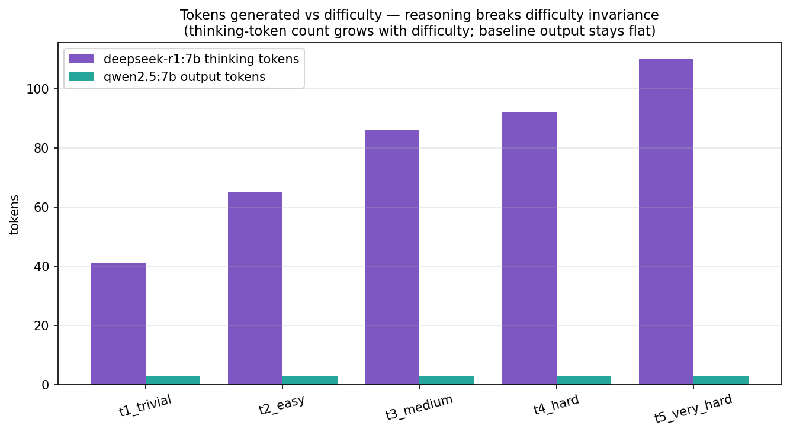
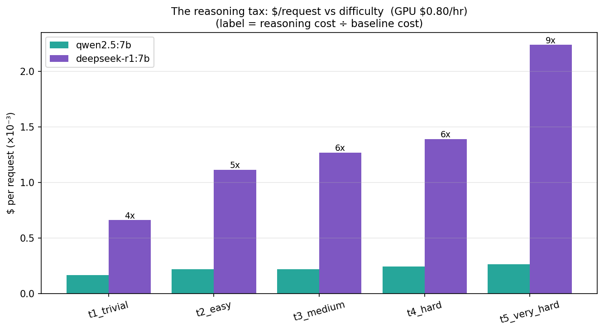

# The Reasoning Tax: What Thinking Models Actually Cost

**What does a reasoning model cost versus a non-reasoning one, and how does that gap scale with problem difficulty?**

Generated from `bench/reasoning_tax.py`. Models: `deepseek-r1:7b` (reasoning) vs `qwen2.5:7b` (baseline) — deepseek-r1 is a reasoning fine-tune of the qwen2.5-7B base, so the comparison holds architecture roughly constant and isolates *reasoning vs not*. Ollama `/api/chat` with `think=true`, temperature 0, GPU rate $0.80/hr, 3 trials/tier.

This extends the **difficulty-invariance** finding ([REPORT.md](REPORT.md) §4): for a standard dense model, per-token decode latency is flat (~42 ms/token) regardless of human difficulty, so cost tracks token *count*. The hypothesis:

> A reasoning model **breaks difficulty invariance** — not because per-token cost changes, but because it emits a variable number of hidden *thinking* tokens that grows with difficulty. Its cost and latency scale with difficulty *through the token count*.

**The result, in one sentence:** the reasoning model costs **4–8.5× more per request** and the premium climbs with difficulty — pure waste on easy problems both models get right, until the task is hard enough that the **baseline fails entirely and reasoning's cost-per-correct-answer goes from infinite to finite.**

---

## The difficulty ladder

Five problems with a single checkable numeric answer, trivial → multi-step, each asking for "just the number" so grading is a clean numeric match and the baseline's output length is comparable across tiers:

| Tier | Problem | Answer |
|---|---|---|
| t1_trivial | 7 + 6 | 13 |
| t2_easy | total cost of 3 books at $12 | 36 |
| t3_medium | average speed, 60 km in 1.5 h | 40 |
| t4_hard | Natalia's clips (GSM8K-style) | 72 |
| t5_very_hard | apples: ⅓ sold, then ¼ of remainder | 60 |

---

## Findings

### 1. Reasoning breaks difficulty invariance — through token count, not per-token cost



The reasoning model's **throughput is flat at ~42 tok/s across every tier** — per-token cost is constant, exactly as difficulty-invariance predicts for a fixed architecture. What changes is the **token count**: hidden thinking tokens climb monotonically with difficulty.

| Tier | reasoning thinking tok | reasoning total out tok | baseline out tok |
|---|---:|---:|---:|
| t1_trivial | 41 | 108 | 3 |
| t2_easy | 65 | 179 | 3 |
| t3_medium | 86 | 207 | 3 |
| t4_hard | 92 | 222 | 3 |
| t5_very_hard | 110 | 375 | 3 |

The baseline emits a flat **3 tokens** regardless of difficulty (it just answers "13", "36", …) — difficulty-invariant in *both* latency and count, because a non-reasoning model gives a short direct answer. The reasoning model spends 41 thinking tokens to compute **7 + 6** — the canonical overthinking case.

### 2. The reasoning tax grows with difficulty



Cost per request, and the tax = reasoning ÷ baseline:

| Tier | baseline $/1k req | reasoning $/1k req | tax |
|---|---:|---:|---:|
| t1_trivial | $0.17 | $0.66 | **4.0×** |
| t2_easy | $0.22 | $1.12 | **5.1×** |
| t3_medium | $0.22 | $1.27 | **5.8×** |
| t4_hard | $0.24 | $1.39 | **5.7×** |
| t5_very_hard | $0.26 | $2.24 | **8.5×** |

Two effects compound. (a) A **per-token penalty**: the reasoning model runs at ~42 tok/s vs the baseline's ~62 tok/s — about **1.5× more expensive per token** ($5.3 vs $3.6 /M tokens). (b) The dominant, difficulty-scaling effect: it emits **far more tokens**. On the trivial tier the tax is already 4×; by the hardest tier it's 8.5×.

### 3. Where the dollars go: thinking *and* a verbose answer


Splitting each reasoning request into prefill / thinking / answer dollars: **prefill is negligible** (~0.25 s, flat), and both the thinking and answer phases grow with difficulty. Notably the **answer phase is the larger of the two** here — deepseek-r1 doesn't just emit "60", it writes a full worked solution (t5: 2.7 s thinking + 6.3 s answer). So the cost is the hidden reasoning *plus* a verbose visible answer, both of which the terse baseline avoids.

### 4. $/correct-answer — the honest metric, and the crossover

$/M tokens is identical-looking accounting; what a buyer pays for is *correct* answers. Both models are 100% accurate on t1–t4, so there the reasoning tax buys **nothing** — it's 4–6× spend for an answer the baseline already gets right. Then at t5:

| Tier | baseline accuracy | reasoning accuracy | baseline $/correct (1k) | reasoning $/correct (1k) |
|---|---:|---:|---:|---:|
| t1–t4 | 100% | 100% | $0.17–0.24 | $0.66–1.39 |
| **t5_very_hard** | **0%** | **100%** | **∞** | **$2.24** |

On the multi-step apples problem the baseline is wrong on every trial (temperature 0 — deterministically wrong), so its cost *per correct answer* is **infinite**: no amount of money buys a right answer from it. The reasoning model is right every time at $2.24/1k. **That is the entire economic case for reasoning models:** a strict cost penalty on everything easy, justified only once the task is hard enough that the cheap model simply can't do it. The engineering implication is routing — send easy traffic to the cheap model, escalate to the reasoning model only when difficulty warrants the tax.

---

## Limitations

- **One model pair, one machine.** `deepseek-r1:7b` vs `qwen2.5:7b` on an Apple M1 (Metal/MPS). The *structure* (thinking-tokens scale with difficulty; the tax; the accuracy crossover) should transfer; absolute numbers don't.
- **Five problems, 3 repeats.** An illustrative ladder, not a benchmark suite — accuracy figures are directional. Grading checks the final integer the model emits.
- **Per-phase token counts are streamed-delta counts** (Ollama streams ~one token per chunk); the total is Ollama's authoritative `eval_count`.
- **Temperature 0** for reproducibility; sampling would add variance, especially in thinking length, and could change the t5 accuracy.

---

## Reproduce

```sh
ollama pull deepseek-r1:7b
python bench/reasoning_tax.py                        # 3 repeats × 5 tiers × 2 models
python bench/reasoning_tax.py --repeats 5 --max-tokens 4096
```
