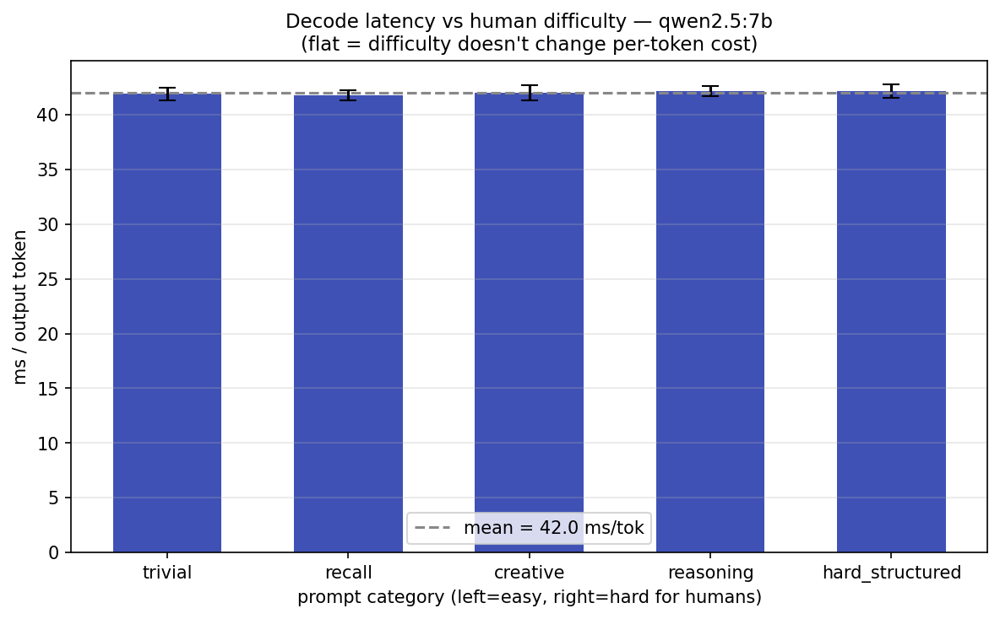

# LLM Inference Benchmark Report

**Local LLM serving on Apple M1 Max — performance and cost (`$/M tokens`).**

*Generated 2026-06-10 from a single reproducible run (`python bench/run_all.py`). Every number below regenerates from `results/` and `results/MANIFEST.json`.*

---

## Executive summary

Every performance number here has a dollar number next to it, at an assumed GPU rate of **$0.80/hr** (`GPU_HOURLY_RATE`, a stand-in for an A10G-class cloud GPU or amortized M1 Max). The rate is swappable; the costs scale linearly with it. Five findings a serving team can act on:

1. **Context length is the most expensive variable.** At a *fixed* output length, a ~12k-token prompt costs **2.6× more per token** than a ~400-token prompt ($23.6 vs $9.1 /M). Prefill time grows **~18×** (1.2s → 22.8s) and decode itself slows **2.5×** as the KV cache balloons to **650 MiB**. Long-context features are not free, and the cost is mostly invisible in a tokens/sec chart.
2. **A decode token costs ~5× a prefill token.** Prefill ingests the whole prompt in one parallel, compute-bound pass; decode emits one token per memory-bound pass. For normal generations prefill is only **5–8%** of request cost — but per token the asymmetry is large, which is why output length dominates the bill.
3. **Ollama is ~1.9× cheaper than MLX** for the same model (qwen2.5:7b) on this hardware ($45 vs $86 /M), because MLX lacks continuous batching and pays for it under concurrency.
4. **Per-token decode latency is invariant to prompt difficulty** (~42 ms/token across trivial→reasoning prompts, ±<1%). Cost is governed by token *count*, not human "hardness" — useful for capacity planning.
5. **On this unified-memory M1, single-stream decode is within ~3% on CPU vs GPU** for both models. Batch-1 decode is memory-bandwidth-bound, so forcing CPU barely changes throughput; the accelerator's advantage is in prefill and batched serving, not single-stream decode. (On a discrete-GPU host the gap would be far larger.)

---

## Methodology

- **Hardware:** Apple M1 Max (`arm`), macOS. Metal/MPS — **no CUDA, no vLLM locally.**
- **Backends:** Ollama 0.24.0 (OpenAI-style serving via `mini-llm-gateway`) and MLX (`Qwen/Qwen2.5-7B`).
- **Models:** `qwen2.5:7b` (Q4), `llama3.2:1b`.
- **Cost model:** `$/M tokens = (GPU_HOURLY_RATE / 3600) / tokens_per_sec × 1e6`, `GPU_HOURLY_RATE=$0.80/hr`. Pure functions in [`bench/cost_calculator.py`](bench/cost_calculator.py), shared verbatim with `mini-llm-gateway`.
- **Rigor:** every model/backend is pre-warmed (cold-start load discarded); each config runs multiple trials; latency distributions (p50/p95/p99) are recorded, not just means; each sweep varies one dimension at a time. Token counts are Ollama's authoritative `eval_count` / `prompt_eval_count`, not estimates.
- **Reproducibility:** `bench/run_all.py` preflights the servers, writes `results/MANIFEST.json` (host, chip, versions, model digests, rate), runs every benchmark, and regenerates all charts. Run manifest for this report is in [`results/MANIFEST.json`](results/MANIFEST.json).

---

## Findings

### 1. Context-length scaling — the dominant cost driver

Output length held fixed; only input (prompt) length varies.


| Input tokens | TTFT (prefill) | Decode (ms/tok) | KV cache | $/M tokens |
|---:|---:|---:|---:|---:|
| 406 | 1.22 s | 42.8 | 22 MiB | $9.13 |
| 1,498 | 2.88 s | 47.9 | 82 MiB | $10.24 |
| 2,980 | 6.62 s | 54.6 | 163 MiB | $11.66 |
| 5,944 | 19.58 s | 72.6 | 325 MiB | $16.04 |
| 11,872 | 22.83 s | 110.0 | 649 MiB | $23.58 |

Prefill is O(context) — TTFT grows ~18×. Decode is *not* perfectly flat at long context: it slows ~2.5× as the KV cache grows and memory bandwidth saturates. KV cache is modeled analytically from qwen2.5-7B's architecture (28 layers, **4 KV heads via GQA**, head_dim 128, fp16) — **56 KiB/token**; GQA is a 7× saving over the 28 attention heads. Full 32k context would need **~1.75 GiB** of KV cache per request.

### 2. Prefill vs decode cost decomposition


Splitting each request's GPU wall-clock cost at TTFT: prefill is **5–8%** of per-request cost for multi-hundred-token generations, but a **decode (output) token costs ~5× a prefill (input) token** of GPU time. Output length, not prompt length, is the primary cost lever for typical requests.

### 3. Ollama vs MLX


For qwen2.5:7b under concurrent load, Ollama delivers higher throughput and **~1.9× lower cost** ($45 vs $86 /M). MLX has no continuous batching, so its cost climbs steeply with concurrency.

### 4. Difficulty invariance



Per-token decode latency is flat at **~42 ms/token (±<1%)** across prompts spanning trivial to multi-step-reasoning difficulty. For a standard (non-reasoning) dense model, per-token cost is set by the architecture, not by how "hard" the prompt is — so cost tracks token count alone.

### 5. CPU vs GPU (Metal) and model size


At concurrency 1: `llama3.2:1b` ≈ **$5.2/M** vs `qwen2.5:7b` ≈ **$11.4/M** — a ~2.2× premium for 7× the parameters. CPU vs GPU throughput is within ~3% for both models on this unified-memory M1 (see executive summary #5).

---

## Limitations

- **Proxy cost rate.** $/M tokens uses an assumed $0.80/hr GPU rate, not a metered cloud bill. The *ratios* between configurations are the durable result; absolute dollars scale with the rate.
- **Local M1, not production GPUs.** No CUDA / vLLM / tensor-parallelism. Findings about prefill/decode/KV-cache *structure* transfer; absolute throughput does not. CPU-vs-GPU results are specific to M1's unified-memory architecture.
- **KV cache is analytical**, computed from model config (Ollama does not expose live cache size on Metal), not a measured allocation.
- **Single-node, modest concurrency.** No distributed serving, autoscaling, or tail-latency-under-load study.

---

## Reproduce

```sh
# start both gateways (in mini-llm-gateway):
BACKEND=ollama uvicorn main:app --port 8000
BACKEND=mlx    uvicorn main:app --port 8001
# then, here:
python bench/run_all.py            # full suite + manifest + charts
python bench/run_all.py --dry-run  # preflight + plan only
GPU_HOURLY_RATE=1.20 python bench/run_all.py   # model a different GPU rate
```
