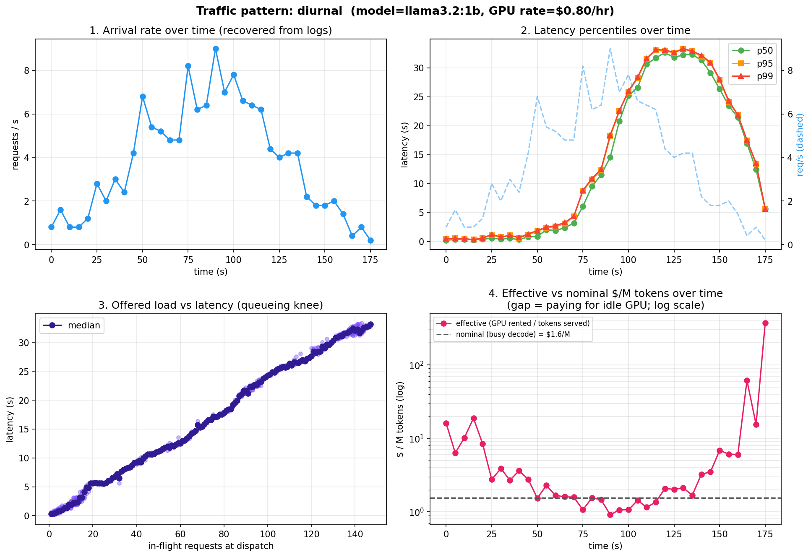
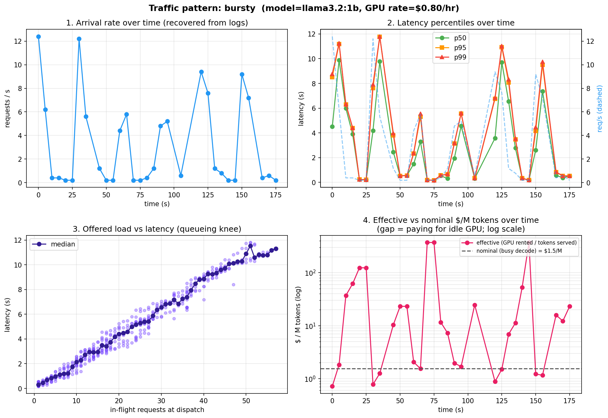

# Traffic Simulation & Capacity Planning

**What happens to latency and cost when realistic, time-varying traffic hits an inference server?**

Generated from `bench/traffic_sim.py` (open-loop load generator) + `bench/analyze_traffic.py`. Model: `llama3.2:1b` via `mini-llm-gateway` (concurrency cap `MAX_CONCURRENT=2`, so sustainable capacity ≈ 3 req/s). Each request carries an `X-Request-ID` the gateway echoes into its JSON access log, so client-side and server-side logs join. GPU rate $0.80/hr.

These are **open-loop** arrivals: requests fire on a schedule whether or not earlier ones have finished, so queues build when arrivals outrun the server — exactly the regime real traffic creates and closed-loop benchmarks miss.

---

## The four patterns

| Pattern | Shape | Requests | p50 | p95 | p99 | Peak in-flight | Effective $/M |
|---|---|---:|---:|---:|---:|---:|---:|
| **poisson** | steady ~2 req/s (below capacity) | 247 | 0.50s | 1.24s | 1.78s | 8 | **$4.08** |
| **bursty** | 0.4 baseline, spikes to 10 | 495 | 4.46s | 10.6s | 11.5s | 57 | $3.35 |
| **diurnal** | sine "day": 0.4 → 7 → 0.4 | 689 | 12.6s | 32.6s | 33.1s | 147 | $2.33 |
| **ramp** | 0.5 → 12 req/s | 950 | 24.3s | 77.6s | 82.5s | 378 | $2.12 |

Nominal cost (busy single-stream decode) is **$1.55/M** for all — the spec-sheet number. 0 errors across 2,381 requests.

---

## Findings

### 1. Tail latency explodes past the knee — and averages hide it

Below ~3 req/s, latency is flat and low (poisson p99 = 1.8s). Push past the server's 2-concurrency knee and the queue runs away: diurnal p99 hits **33s**, ramp p99 hits **82s** with **378** requests queued. Panel 3 of each chart shows the knee directly — latency rising linearly with in-flight requests once the semaphore is saturated. The danger: early in a ramp the *average* still looks fine while p99 is already climbing. **Alert on p95/p99, not the mean.**

### 2. The latency-vs-cost tension (the counterintuitive one)

The configuration with the **best latency has the worst cost per token.** Steady poisson load (p99 1.8s) runs at **$4.08/M — 2.6× nominal** — because at moderate load the GPU sits idle between requests and you pay for that idle silicon. The saturated ramp (p99 82s, awful) is **cheapest at $2.12/M** because the GPU is always busy.

> You can optimize for **latency** (provision for peak → low utilization → high $/token) or for **utilization** (run hot → cheap tokens → queueing at peak), but not both. That trade-off *is* the capacity-planning decision.

### 3. Idle GPU = expensive tokens

Panel 4 (log scale) plots effective $/token over time against the nominal line. Effective cost is **inversely related to load**: near the diurnal trough the nearly-idle GPU pushes the interval's effective cost to **~$350/M** (200× nominal). This is the concrete version of "your $/token is higher than the spec sheet" — the spec sheet assumes 100% utilization you never actually have.

### 4. Bursts demand headroom, not average provisioning

Bursty traffic with a quiet **0.4 req/s baseline** still drove p99 to **11.5s** and 57 queued during its spikes. Provisioning to the average would violate the SLO on every burst; you must size to the burst (or autoscale fast enough to catch it).

### 5. Little's Law holds (L ≈ λ·W)

The measured average in-flight tracks `throughput × mean-latency` across every pattern (e.g. ramp: 126 predicted vs 139 measured; diurnal: 57 vs 66) — a sanity check that the open-loop generator and the queueing measurements are internally consistent.

---

## Provisioning implications

- **Latency-SLO-bound service:** size to peak load. Accept low average utilization and the resulting higher $/token as the price of the SLO.
- **Cost-bound batch/async workload:** run the GPU hot (high utilization, cheap tokens) and let work queue.
- **Diurnal real-world traffic:** neither static choice is good — this is the case for **autoscaling** that tracks the demand curve, capturing low $/token at peak without paying for idle GPUs at the trough. The diurnal run quantifies exactly what a static fleet wastes at the trough.

---

## Reproduce

```sh
# gateway up (in ../mini-llm-gateway): BACKEND=ollama uvicorn main:app --port 8000
python bench/traffic_sim.py --pattern diurnal --duration 180 --base-rate 0.4 --peak-rate 7
python bench/traffic_sim.py --pattern ramp    --duration 150 --base-rate 0.5 --peak-rate 12
python bench/traffic_sim.py --pattern bursty  --duration 180 --base-rate 0.4 --peak-rate 10
python bench/traffic_sim.py --pattern poisson --duration 120 --base-rate 2
python bench/analyze_traffic.py     # charts + Little's Law for the latest run of each pattern
```





