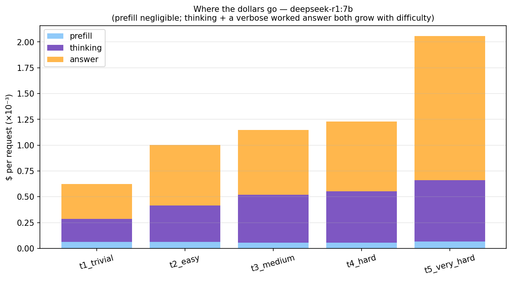
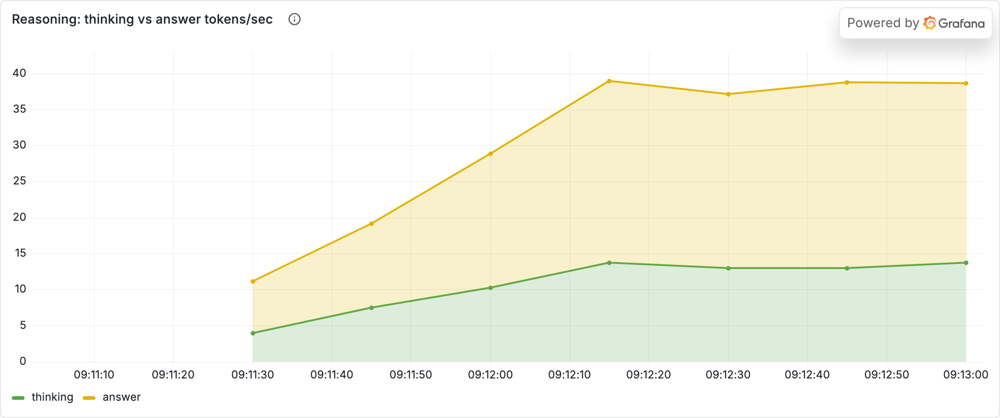
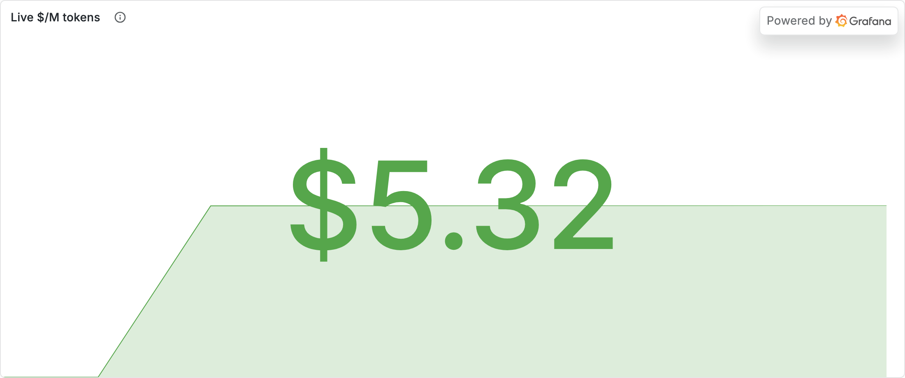
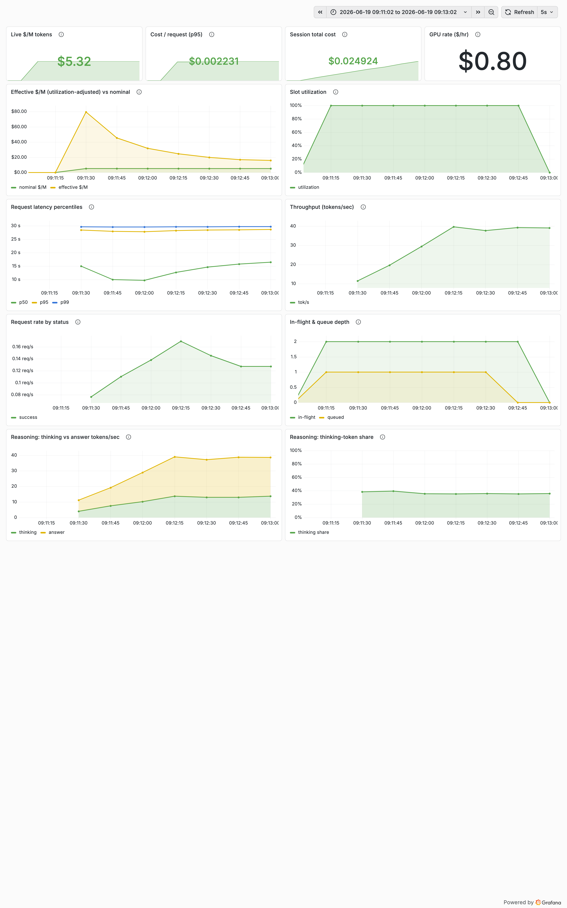

# Experiment 01 — Analysis

**Run:** GPU rate $0.80/hr. Comparison from `bench/reasoning_tax.py` (deepseek-r1:7b vs qwen2.5:7b, 5 tiers × 3 trials). Live serving from `loadgen --reasoning` through the gateway (90 s, concurrency 3); Grafana window pinned to that run.

## Verdict
> **Supported, strongly.** Reasoning keeps the same ~42 tok/s per-token rate but emits thinking tokens that climb with difficulty (41 → 110), so $/request runs **4.0× → 8.5×** the baseline and the multiplier grows with difficulty. It's pure waste where both models are right — until the hardest tier, where the baseline is **wrong every time** and reasoning is **right every time**, sending the baseline's cost *per correct answer* to **∞**. Live, **~38% of every token billed was invisible thinking.**

## Evidence — the comparison (benchmark)

### Reasoning breaks difficulty invariance

**What you're looking at:** thinking-token count (purple) per difficulty tier vs the baseline's total output tokens (teal).
**What it means:** the baseline answers in a flat **3 tokens** no matter the difficulty; the reasoning model's hidden thinking climbs **41 → 65 → 86 → 92 → 110**. Difficulty maps onto token *count* — exactly the predicted break from difficulty invariance.

### The reasoning tax, and that it grows

**What you're looking at:** $/request, baseline vs reasoning, by tier; labels are the ratio.
**What it means:** **4.0× → 5.1× → 5.8× → 5.7× → 8.5×**. Two compounding effects: reasoning runs ~1.5× slower per token (42 vs 62 tok/s) *and* emits far more tokens, the part that scales with difficulty.

### Where the dollars go

**What you're looking at:** each reasoning request's cost split into prefill / thinking / answer.
**What it means:** prefill is negligible; thinking *and* a verbose worked answer both grow with difficulty (deepseek-r1 writes out full solutions, not just "60").

## Evidence — live serving (Grafana, pinned to the run)

### Live thinking-token share

**What you're looking at:** `thinking_tokens / (thinking + answer)` over the run.
**What it means:** it settles around **0.35–0.38** — better than a third of the tokens the gateway billed were hidden reasoning the user never sees. This is the live, metered version of the benchmark's token story.

### Thinking vs answer throughput

**What you're looking at:** thinking vs answer tokens/sec, stacked, under real load.
**What it means:** both streams are continuously present — the gateway is separating and billing the hidden phase in real time, not just at benchmark time.

### Cost and queueing under reasoning load

**What you're looking at:** live $/M tokens while serving deepseek-r1.
**What it means:** elevated vs the baseline's ~$3.6/M because reasoning's throughput is lower — the per-token half of the tax, live.

## Numbers
| tier | thinking tok | baseline $/1k req | reasoning $/1k req | tax | baseline acc | reasoning acc |
|---|---:|---:|---:|---:|---:|---:|
| t1_trivial | 41 | $0.17 | $0.66 | 4.0× | 100% | 100% |
| t2_easy | 65 | $0.22 | $1.12 | 5.1× | 100% | 100% |
| t3_medium | 86 | $0.22 | $1.27 | 5.8× | 100% | 100% |
| t4_hard | 92 | $0.24 | $1.39 | 5.7× | 100% | 100% |
| t5_very_hard | 110 | $0.26 | $2.24 | 8.5× | **0%** | **100%** |

Live thinking-token share: **~0.38**. Reasoning throughput ~42 tok/s vs baseline ~62 tok/s.

## Caveats
- Single model pair on an Apple M1 (Metal/MPS); the *structure* transfers, absolute numbers don't.
- 5 problems, 3 trials — accuracy is directional. Grading checks the final integer.
- Live thinking/answer split is exact (streamed delta tally via `/think/stream`); benchmark split uses the same method.
