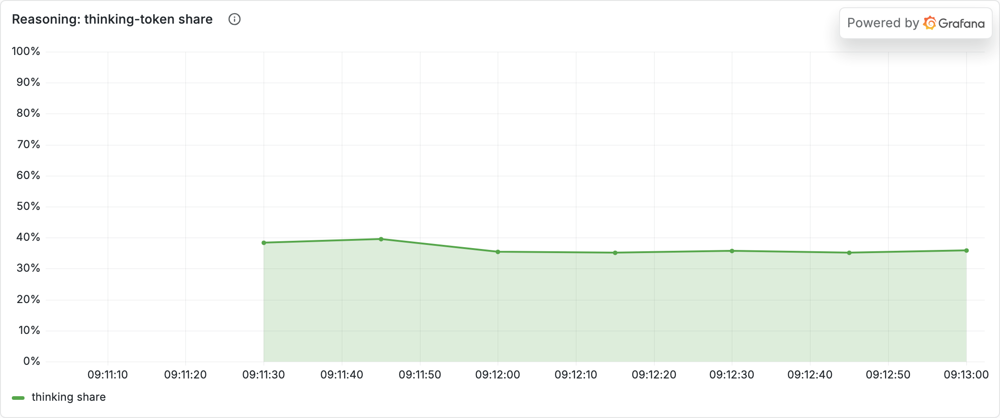

# Experiment 01 — The Business Story

*A hypothetical to make the numbers matter. Fictional company; the data is real (see [analysis.md](analysis.md)).*

## The company
**Meridian Support** runs an AI agent that answers customer-support tickets for mid-market SaaS firms — **~1,000,000 tickets/month**. They self-host open models. A new VP of Eng arrives and says: *"deepseek-r1 reasons — it's smarter. Switch everything to it and our resolution rate goes up."* Finance wants to know what that costs.

## The decision on the table
**Default the whole pipeline to a reasoning model, or not?** It sounds like a pure quality win. Is it?

## What the experiment tells them
Reasoning is **not** a free upgrade — it's a **4×–8.5× cost multiplier**, and the multiplier *grows* with difficulty.

The trap is hidden in tokens the customer never sees. Live through the gateway, **~38% of every token billed on the reasoning model was internal "thinking"** — you pay for a private scratchpad on every ticket.

And here's the kicker: on the easy and medium tickets — the bulk of the queue — **both models are 100% correct**. Paying 4–6× for reasoning there buys *nothing*. The reasoning model only pulls ahead on the genuinely hard tickets, where the cheap model is wrong every time:

| ticket difficulty | cheap model | reasoning model | reasoning worth it? |
|---|---:|---:|---|
| easy / medium (the ~80%) | ✅ correct | ✅ correct | ❌ pure 4–6× overpay |
| genuinely hard (the ~20%) | ❌ 0% correct | ✅ 100% correct | ✅ buys the answer |

On the hardest tier the cheap model's **cost per *correct* answer is infinite** — it never gets there. That's the only place the tax is justified.

## The recommendation
> **Don't default to reasoning — route to it.** Run the cheap model by default; add a lightweight difficulty classifier that escalates only the hard minority to the reasoning model. If ~80% of tickets are ones the cheap model already answers correctly, routing them away from reasoning **cuts the reasoning spend by roughly 80%** while keeping the accuracy win exactly where it's needed. "Reasoning everywhere" pays a 4–6× premium for a private scratchpad on tickets that never needed one.

## The one-sentence executive summary
> Reasoning models are a 4–8× cost multiplier whose benefit only appears on the hardest fraction of traffic — so the win is **routing**, not switching: serve cheap by default, escalate to reasoning on demand, and you keep the quality where it matters while avoiding a several-fold bill on the work that never needed it.
