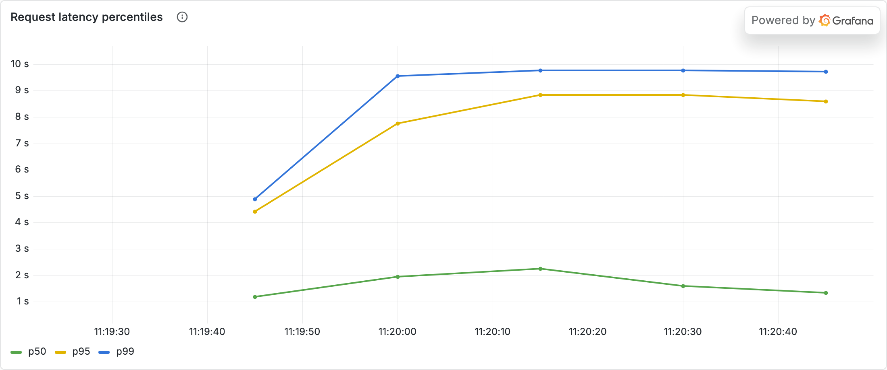
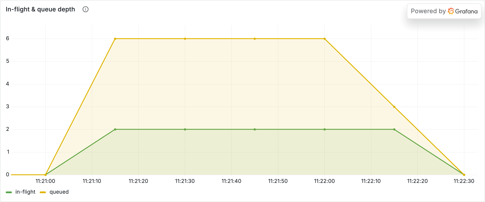
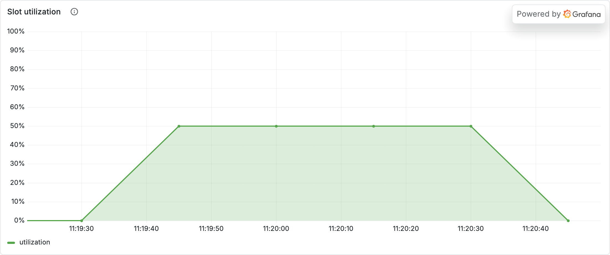
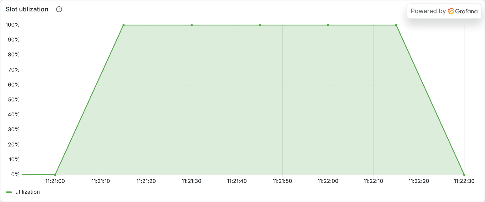
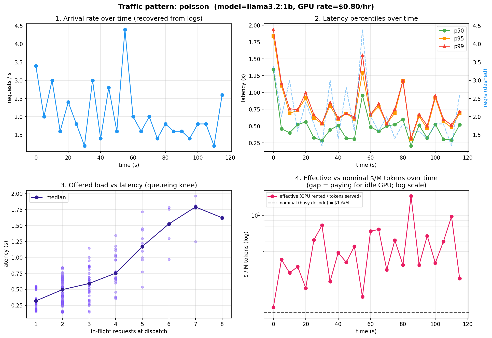
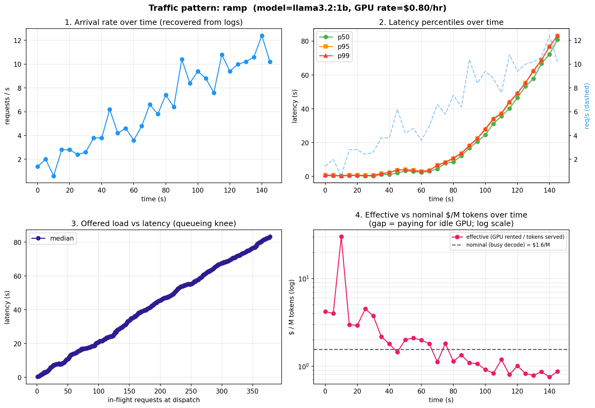

# Experiment 02 — Analysis

**Run:** `qwen2.5:7b`, gateway concurrency cap = 2, $0.80/hr. Live contrast: under-capacity (1 concurrent) vs over-capacity (8 concurrent), each a pinned ~70 s run. Rigorous version: `bench/traffic_sim.py` across four arrival shapes.

## Verdict
> **Supported.** You can't have both. Under-capacity gives great latency but the idle GPU makes tokens **expensive**; over-capacity makes tokens **cheap** but the queue runs away and tail latency explodes. Across the four realistic traffic shapes, the pattern with the *best* latency (steady, p99 1.8 s) had the *worst* cost (**$4.08/M, 2.6× nominal**), and the saturated ramp (p99 **82 s**) was the *cheapest* (**$2.12/M**).

## Evidence — live contrast

### Latency: flat vs exploding

**What you're looking at:** p50/p95/p99 request latency — under-capacity (top) vs over-capacity (bottom).
**What it means:** below the cap, latency is flat and low (1 request at a time, no waiting). Past the cap, requests pile up behind the 2 slots and p99 climbs far above p50 — the queue, not the model, is now the latency.

### The queue knee

**What you're looking at:** in-flight vs queued requests, over-capacity.
**What it means:** in-flight pins at the cap (2) while queue depth climbs — the server is saturated and everything else waits. This is the "knee" past which adding load only adds latency, not throughput.

### Utilization: idle vs hot (the cost driver)

**What you're looking at:** slot utilization, under (top) vs over (bottom).
**What it means:** under-capacity the GPU is mostly idle — and you pay for idle silicon, so **effective $/token is high**. Over-capacity it runs ~100% busy — **cheap tokens**, awful latency. Utilization is the hidden knob behind cost.

## Evidence — the four arrival shapes (benchmark)

| pattern | p99 latency | effective $/M | vs nominal |
|---|---:|---:|---:|
| steady (below capacity) | 1.78 s | **$4.08** | 2.6× |
| bursty | 11.5 s | $3.35 | 2.2× |
| diurnal | 33.1 s | $2.33 | 1.5× |
| ramp (saturated) | 82.5 s | $2.12 | 1.4× |

Nominal (busy single-stream) is $1.55/M. **Best latency = worst cost; cheapest = worst latency.** That inverse relationship *is* the capacity decision.

## Numbers
- Concurrency cap = 2 → sustainable ≈ 3 req/s. 0 errors across all runs.
- Little's Law (L ≈ λ·W) held across the benchmark patterns — the queueing is real, not measurement noise.

## Caveats
- Effective $/M on the live panel is smoothed over a 5-minute window, so the *benchmark* charts are the cleaner cost-vs-pattern evidence; the live panels best show latency/queue/utilization, which respond immediately.
- Single M1, modest concurrency; the tension transfers, absolute rates don't.
