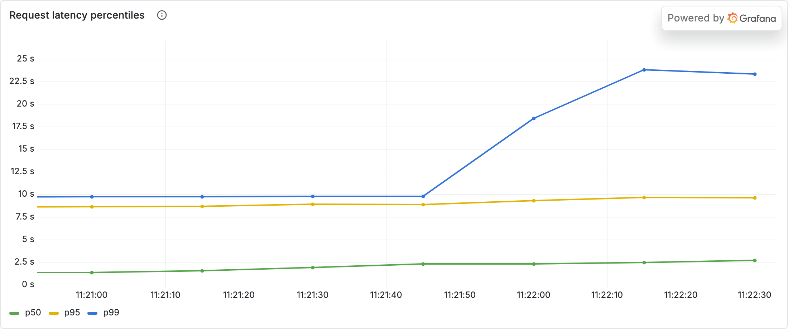

# Experiment 02 — The Business Story

*A hypothetical to make the numbers matter. Fictional company; the data is real (see [analysis.md](analysis.md)).*

## The company
**Helio** runs a consumer AI app with strongly **diurnal** traffic — quiet overnight, a sharp midday peak. They self-host on a fixed GPU fleet. Two camps are arguing: Product wants a tight latency SLA (p99 < 3 s); Finance is alarmed that the $/token on the bill is **2–3× the spec-sheet number** and wants utilization up.

## The decision on the table
**How do we size the fleet — for the peak (great latency, low utilization) or for the average (cheap tokens, queues at peak)?** Both camps think the other is being unreasonable.

## What the experiment tells them
They're both right, and that's the point: **latency and cost per token are in direct tension.**
- Provision for peak → the GPU idles most of the day → great latency but **effective $/token ~2.6× nominal** (you pay for idle silicon).
- Run hot → cheap tokens → but past the capacity knee, **tail latency explodes** (p99 went from 1.8 s to **82 s** in the saturated run).

Neither static choice fits diurnal traffic: size for peak and you waste money all night; size for average and you blow the SLA every midday.

## The recommendation
> **Stop arguing over one static size — autoscale to the demand curve.** A fleet that tracks the diurnal shape captures cheap tokens at peak (high utilization) *without* paying for idle GPUs at the 3am trough. Reserve a baseline for the floor, add burst capacity (on-demand/spot) for the peak. The benchmark quantifies exactly what a static fleet wastes at the trough — that waste is the autoscaling budget.

## The one-sentence executive summary
> Latency and $/token trade off directly against utilization, so for time-varying traffic the answer isn't "bigger" or "cheaper" — it's **autoscaling**: track the demand curve to get peak-time efficiency without paying for idle GPUs the rest of the day.
