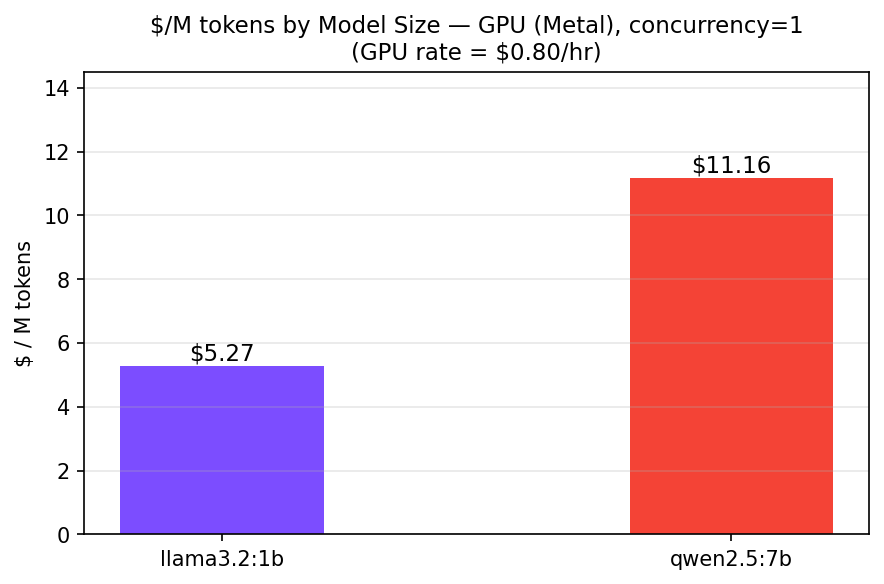
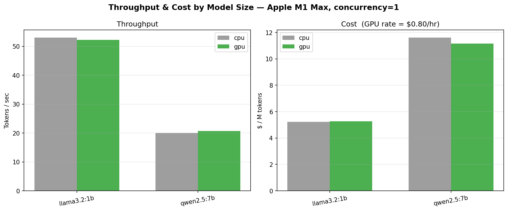
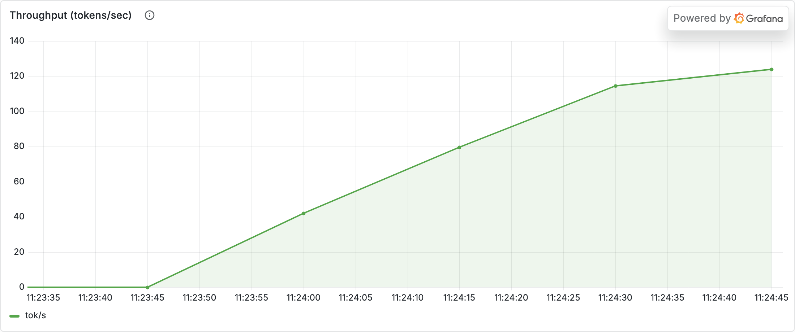
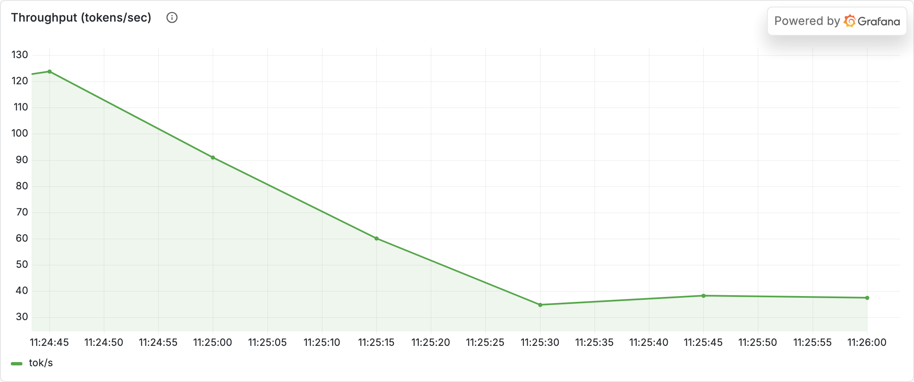

# Experiment 03 — Analysis

**Run:** single-stream through the gateway, $0.80/hr. Live contrast: `llama3.2:1b` vs `qwen2.5:7b`, each a pinned ~55 s run (concurrency 2). Rigorous version: `bench/load.py` model sweep.

## Verdict
> **Supported.** The 7B model costs **~2.2× the 1B** ($11.4/M vs $5.2/M at concurrency 1) — **not 7×**, despite having 7× the parameters. Decode is memory-bandwidth-bound, so cost scales sub-linearly with model size: you pay for the extra weights you must stream each step, but nowhere near proportionally. The 1B is correspondingly faster per token.

## Evidence

### Cost per token by size (benchmark)

**What you're looking at:** `$/M tokens` for each model at concurrency 1.
**What it means:** **$5.2/M (1B) vs $11.4/M (7B)** — a ~2.2× premium for 7× the parameters. The premium is real but far smaller than the size ratio, because the bottleneck is moving weights through memory, not raw FLOPs.

### Throughput + cost vs size (benchmark)

**What you're looking at:** throughput (tokens/sec) and cost, 1B vs 7B, CPU vs GPU.
**What it means:** the 1B runs markedly faster (cheaper per token). Note CPU vs GPU throughput is within ~3% on this unified-memory M1 — batch-1 decode is bandwidth-bound, so the accelerator barely helps a single stream (it pays off in prefill and batching).

### Live throughput contrast (Grafana)

**What you're looking at:** live tokens/sec, 1B (top) vs 7B (bottom), metered through the gateway.
**What it means:** the 1B sustains a visibly higher token rate for the same hardware — the live, served version of the cost gap (higher throughput → lower $/token).

## Numbers
| model | params | throughput (rel.) | $/M tokens | vs 1B |
|---|---:|---|---:|---:|
| llama3.2:1b | 1B | faster | $5.2 | 1.0× |
| qwen2.5:7b | 7B | slower | $11.4 | 2.2× |

## Caveats
- The live $/M panel (panel 1) is a rolling gauge that blends models across a run switch, so the **benchmark chart is the clean per-model cost evidence**; the live throughput panel (8) cleanly shows each model's rate over its pinned window.
- Cost ≠ quality. This experiment measures only the cost side; whether the 1B clears the quality bar for a given task is the other half of the decision.
