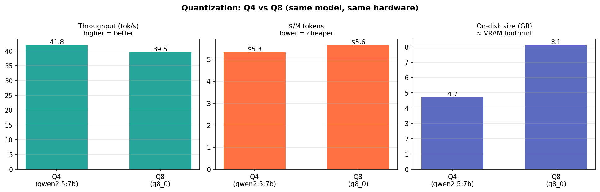

# Experiment 05 — Analysis

**Run:** `bench/quantization.py`, Apple M1 (Metal/MPS), Ollama, $0.80/hr. `qwen2.5:7b` (Q4_K_M) vs `qwen2.5:7b-instruct-q8_0` (Q8). Throughput on medium generations; accuracy on a 4-item numeric ladder.

## Verdict
> **Surprised — the prediction was half wrong, in an instructive way.** Memory scaled as expected (Q8 = **1.72×** the size), but throughput and cost **barely moved** — Q8 was only **1.06× slower** ($5.63 vs $5.31 /M, ~6%), not the ~1.7× I predicted. So on this hardware quantization buys you **VRAM footprint, not speed.** Accuracy was identical (75%) on the small ladder — inconclusive on quality.

## Evidence

**What you're looking at:** throughput (tok/s), $/M tokens, and on-disk size for Q4 vs Q8.
**What it means — and why the prediction broke:** I expected decode (memory-bandwidth-bound) to be ~1.7× slower at Q8 because it moves ~1.7× more weight bytes per token. It wasn't. Q4 packs weights into 4 bits, but the GPU must **dequantize** them back to compute precision every token, and that unpacking is more expensive than Q8's. So Q4's memory-bandwidth advantage is largely *spent* on extra dequantization compute — the two effects roughly cancel, and throughput is nearly the same.

The thing that *does* differ cleanly is **memory**: Q8 takes 1.72× the footprint. On a fixed-VRAM GPU that's the binding constraint — it's what decides how many concurrent sessions and how much KV-cache context you can hold, not the ~6% speed gap.

## Numbers
| | Q4 (qwen2.5:7b) | Q8 (q8_0) | ratio |
|---|---:|---:|---:|
| throughput | 41.8 tok/s | 39.5 tok/s | 1.06× slower |
| $/M tokens | $5.31 | $5.63 | 1.06× |
| on-disk size | 4.7 GB | 8.1 GB | **1.72×** |
| accuracy (4-item) | 75% | 75% | — |

## Caveats
- **Quality is not really measured here.** Four numeric problems can't detect the subtle degradation quantization causes; both models missed the same one (17×23). A real quality verdict needs a proper eval (e.g. MMLU/GSM8K). Treat the accuracy column as a smoke test, not evidence Q4 == Q8 in quality.
- M1 / Metal / Ollama specific. The *direction* (Q8 = more memory; dequant compute offsets Q4's bandwidth win) is general, but on a bandwidth-starved discrete GPU the throughput gap could be larger.
