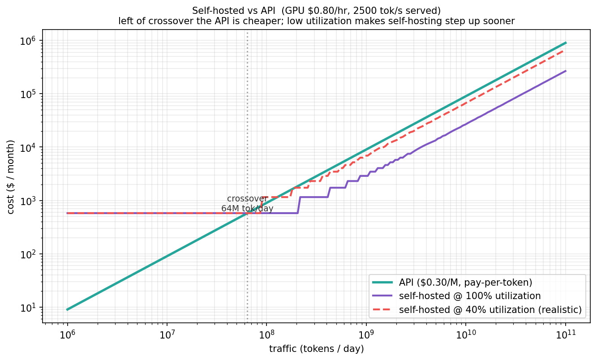

# Experiment 06 — Analysis

**Run:** `bench/selfhost_vs_api.py`. Assumptions: self-hosted GPU $0.80/hr at 2,500 tok/s served; API $0.30/M tokens (7–8B-class hosted endpoint). The *shape* is the result; the exact crossover moves with these inputs.

## Verdict
> **Supported.** The crossover is at **~64M tokens/day (~250k requests/day** at 256 tokens each). Below it the API is cheaper — a whole GPU is wasteful for trickle traffic. Above it self-hosting wins on flat cost, **but only if you keep the GPU busy**: at 40% utilization you're forced to buy the next GPU sooner, and the self-hosted curve steps up above the fully-utilized one.

## Evidence

### The crossover

**What you're looking at:** monthly cost ($) vs traffic (tokens/day), log-log. Teal = API (linear). Purple = self-hosted at 100% utilization; red dashed = at 40%.
**What it means:**
- **Left of ~64M tok/day** the API line sits below self-hosting: pay-per-token beats renting a GPU that's mostly idle. This is the idle-GPU tax from [experiment 02](../02-traffic-and-capacity/) wearing a procurement hat.
- **Right of the crossover** the flat self-hosted cost undercuts the linear API bill — *if* you can fill the GPU. The two self-hosted curves diverge as volume grows: at 40% utilization you exhaust effective capacity sooner and add GPUs (steps up) ahead of the 100% curve. Utilization, not the sticker GPU price, decides whether self-hosting actually pays.

## Numbers
| | API | self-hosted (1 GPU) |
|---|---|---|
| cost shape | linear in tokens | flat $/month, steps per GPU |
| idle cost | $0 | full (you rent it 24/7) |
| crossover (these assumptions) | — | ~**64M tok/day** (~250k req/day) |
| what decides the win | — | **utilization** |

## Caveats
- A model, not a measurement: the crossover **moves** with GPU rate, served throughput, and API price (all CLI args). Real served throughput on a batched GPU (vLLM) is much higher than this repo's single-stream M1 numbers — that pushes the crossover right (one GPU serves more).
- Ignores the *hidden* costs of self-hosting (ops, on-call, engineering, downtime) and of APIs (rate limits, lock-in, data egress) — both real, both one-sided arguments people forget.
